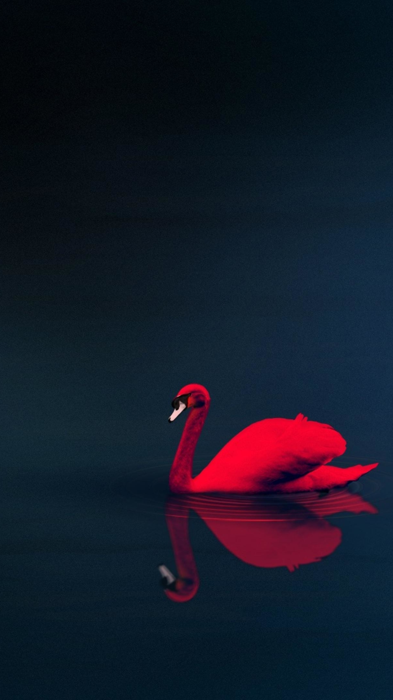
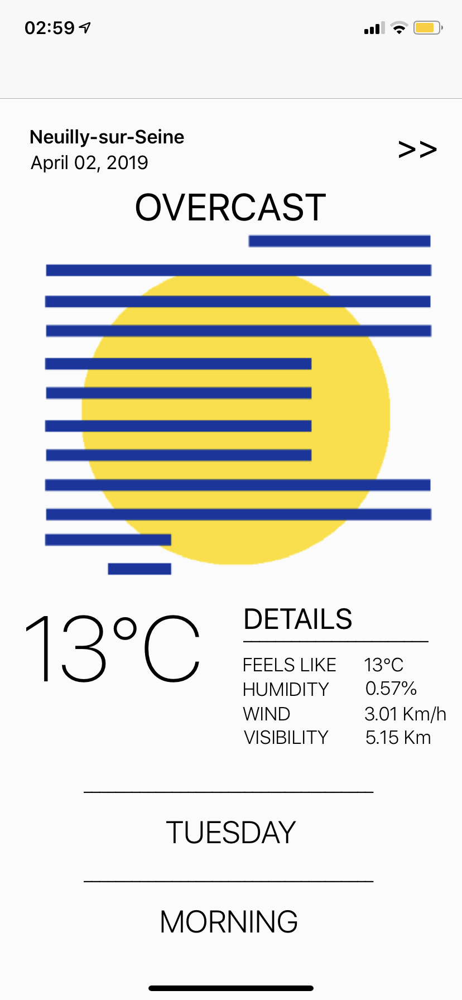
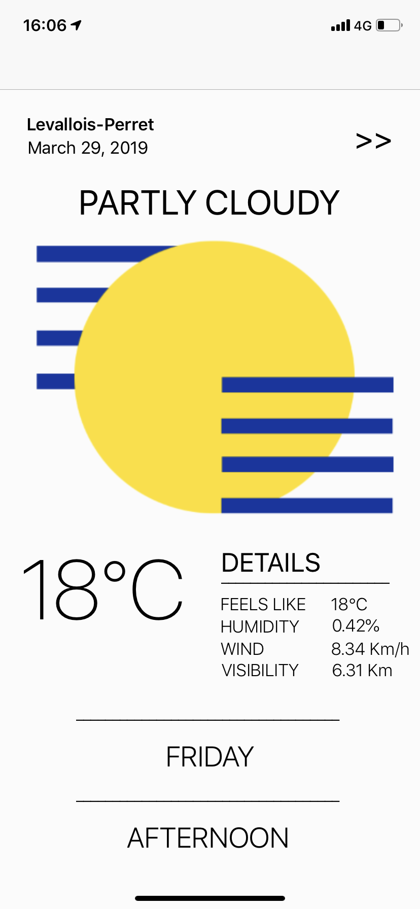
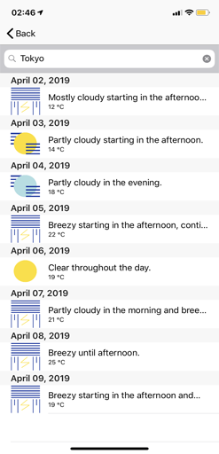
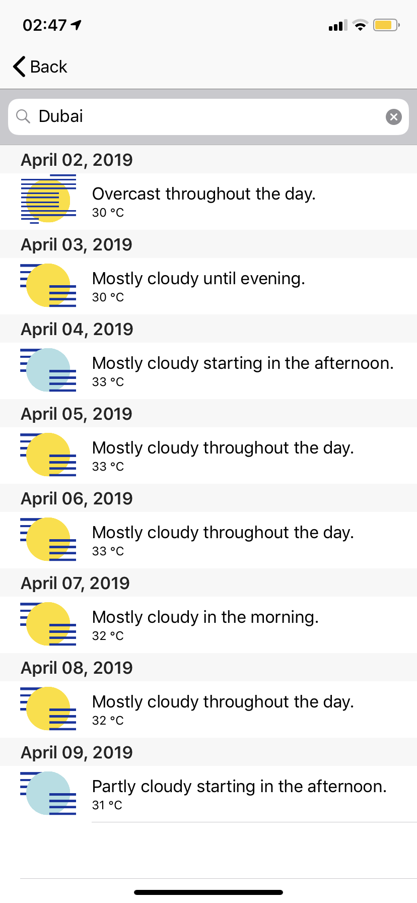
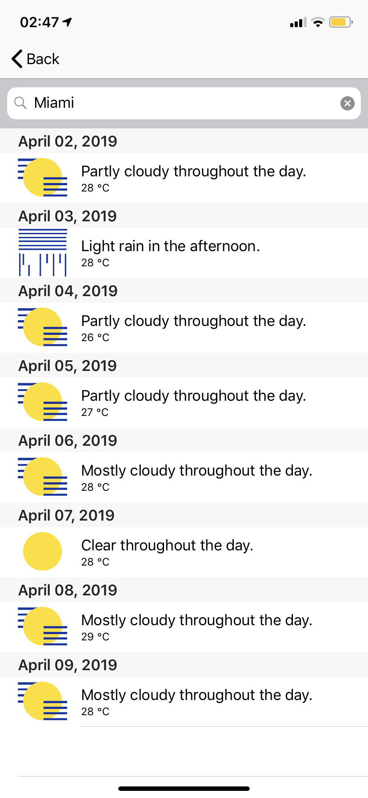

# Xplorer 
# Weather App

## Introduction

Mobile project developed for iOS with the Swift language.

This app basically displays the weather of your current location using CoreLocation. 
If you click on the ">>" button, you will access a second page. This page displays the weather of the week of your current location. And if you want to have the weather of other places, you can use the search bar and tap anything : an address, a city, a country...

I used the dark sky API in order to fetch weather's info.

## Technical Sheet

- MVC 
- Alamofire in order to make HTTP requests
- URLSession also for HTTP requests (easier to manage than Alamofire for complex requests) + JSONSerialization
- Two screens : one with the detail of your current location, one with a list
- Display of a list with UITableView
- Gitflow
- CocoadPods
- CoreLocation for the User's location + use of the different methods in order to do geocoding or reverse geocoding
- Multiple use of Completion Handlers in order to work with asynchronous functions
- Storage of the User's location in cache with UserDefaults
- Use of DateFormatter in order to convert UnixTime
- Search Bar

## Different functionalities

### Launch Screen

<i> Picture of a red cygn </i>

### Weather of your current location

      

### Weather of the week of your current location or the location you want

             

<i> Bla bla bla </i>

### Demonstration

<i> First page of the app inspired by <a href="https://etapes.com/gabriel-nazoa-weather-app/#&gid=1&pid=1">Gabriel Nazoa</a> </i>  
ps: I was forced to recreated all the icons with Photoshop since the quality wasn't good with a screen of the screen of Gabriel
